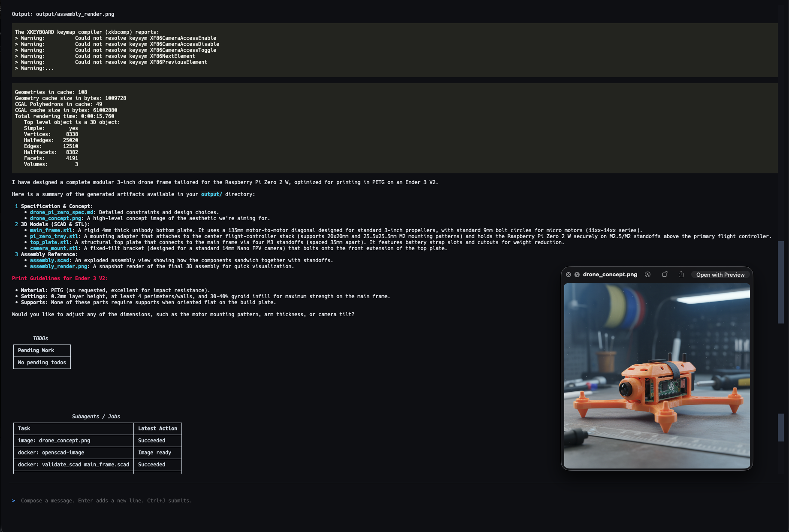

# 3D Print Planning Assistant

This repo is an interactive agent runtime for planning and iterating 3D-print designs with OpenSCAD. It keeps the planning and tool-execution loop from the workshop on [Building your own Deep Research Agent](https://github.com/hugobowne/build-your-own-deep-research-agent) with Hugo and Ivan, but the workflow here is focused on design requirements, SCAD generation, validation, STL export, renders, and concept images.

## Features

- Provider-selectable runtime for Gemini, OpenAI, and Anthropic
- Planning mode followed by execution mode with live TODO tracking
- Textual TUI with multiline compose, fixed TODO and jobs panels, and live tool status
- Workspace file tools for incremental OpenSCAD edits
- Docker-backed OpenSCAD tools:
  - `validate_scad(path)`
  - `export_stl(path, output_path)`
  - `render_scad(path, output_path, ...)`
- Provider-aware concept image generation:
  - `generate_concept_image(prompt, output_path, provider=auto)`
- Default artifact organization under `output/`
- Optional Exa-backed web search for standards, references, and similar projects

## Requirements

- Python 3.12+
- `uv`
- Docker
- At least one provider API key:
  - `GEMINI_API_KEY`
  - `OPENAI_API_KEY`
  - `ANTHROPIC_API_KEY`

`EXA_API_KEY` is optional and only needed if you want search tools to work.

## Setup

Install dependencies:

```bash
uv sync
```

Create a `.env` file for your API keys:

```bash
GEMINI_API_KEY=...
OPENAI_API_KEY=...
ANTHROPIC_API_KEY=...
EXA_API_KEY=...
OPENSCAD_DOCKER_IMAGE=3d-print-assistant-openscad
```

Build the OpenSCAD image once:

```bash
docker build -t 3d-print-assistant-openscad -f docker/openscad/Dockerfile .
```

The tool runtime will also try to build the configured image automatically if it is missing.

## Run

Direct CLI usage:

```bash
uv run python app.py --provider gemini --model gemini-3.1-pro-preview
uv run python app.py --provider openai --model gpt-5.4
uv run python app.py --provider anthropic --model claude-opus-4-6
```

Preset shortcuts:

```bash
uv run planner-openai
uv run planner-claude
uv run planner-gemini
```

You can still pass extra flags after the preset:

```bash
uv run planner-openai --max-iterations 20
uv run planner-gemini --thinking-level HIGH
```

Available flags:

```bash
uv run python app.py --help
```

Current CLI options:

- `--provider {anthropic,gemini,openai}`
- `--model MODEL`
- `--thinking-level {LOW,MEDIUM,HIGH}`
- `--max-iterations MAX_ITERATIONS`
- `--openscad-image OPENSCAD_IMAGE`

## Interface

Composer controls:

- `Enter` inserts a new line
- `Ctrl+J` submits the message
- Multi-line paste is supported

The TUI keeps TODOs and background jobs visible in fixed, scrollable panels while the transcript continues above them.

## Workflow

The assistant is designed to:

1. Clarify design intent, dimensions, printer constraints, material, and success criteria.
2. Write a specification markdown file in `output/`.
3. Generate a concept image in `output/`.
4. Generate a concrete task plan.
5. Write or patch `.scad` files in `output/`.
6. Validate them with Dockerized OpenSCAD.
7. Export STL files and render PNG previews into `output/` when needed.
8. Add lightweight Python checks in `output/` when dimensional or regression checks are useful.

The default artifact convention is:

- `output/<name>_spec.md`
- `output/<name>_concept.png`
- `output/<name>.scad`
- `output/<name>.stl`
- `output/<name>.png`
- `output/<name>_checks.py`

## Example Prompt

```txt
Let's build a window cover for an interior round shaped window to be printed on an Ender 3 v2.

Here are the details:

• Window diameter: 630 mm
• Frame/trim diameter: ~640–650 mm (allowing for measurement tolerance and clearance)
• Cover style: Segmented rigid blackout disk (12 radial segments, each split into 2 printable halves with backing ring support)
• Purpose: Full light blackout for circular window (privacy + light blocking)
• Indoor/outdoor: Indoor
• Material: PETG (preferred for durability, heat resistance, and reduced brittleness vs PLA)
• Max cover diameter: 220 mm per individual printed part (Ender 3 V2 build plate constraint)
• Removable?: Yes (modular screw-assembled design with optional finger notch for removal)
• Appearance: Minimal, matte, uniform surface (front-facing smooth skin with internal ribbing hidden on rear)
```

## Examples

Drone concept example:



## Notes

- OpenSCAD execution is file-first. The agent works with `.scad` files in the workspace and validates or exports them by path.
- Dockerized OpenSCAD jobs use a bounded timeout and report status in the jobs panel.
- Gemini function-calling support in this repo preserves `thought_signature` metadata so tool calls continue correctly across turns.
- Search is optional. The app starts normally without Exa configured.
- CuraEngine, slicing, and post-print feedback loops are not part of this first implementation.

## Acknowledgements

Thanks to Hugo and Ivan for the original deep-research-agent workshop that inspired the underlying runtime shape.
